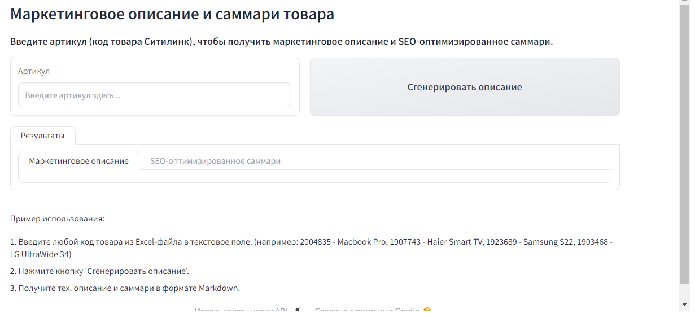

# Нейроконсультант
## Полуавтоматическая платформа для онлнайн-маркетплейсов
### Структура репозитория
Файлы соответствуют инструментам для сотрудника маркетплейса:
- clever_search - код инструмента для интеллектуального поиска по товарам
- neuro_mentor - код инструмента для онбординга новых сотрудников
- text_generation - код инструментов для генерации описаний товаров и парсинга различных источников.

Скриншот приложения для генерации описания товаров:

### Окружение
Используются возможности облачной платформы [Yandex Cloud](https://yandex.cloud/ru/), особенно - возможности сервисов [Yandex DataSpere](https://datasphere.yandex.cloud) и [Yandex Compute Cloud](https://yandex.cloud/ru/services/compute).
В качестве операционной системы используется Ubuntu 22.04.

### Стек
- Python 3.10
- YandexGPT
- Gradio
- Streamlit

### Генерация текста по гетерогенным признакам
Товары на маркетплейсе - коллекция сущностей с неоднородными (гетерогенными признаками), которые пока что плохо поддаются нейронным сетям. Однако существует ряд подходов, помогающий решить возникающие проблемы. Некоторые из них были предложены участниками команды и являются уникальными на рынке. 

